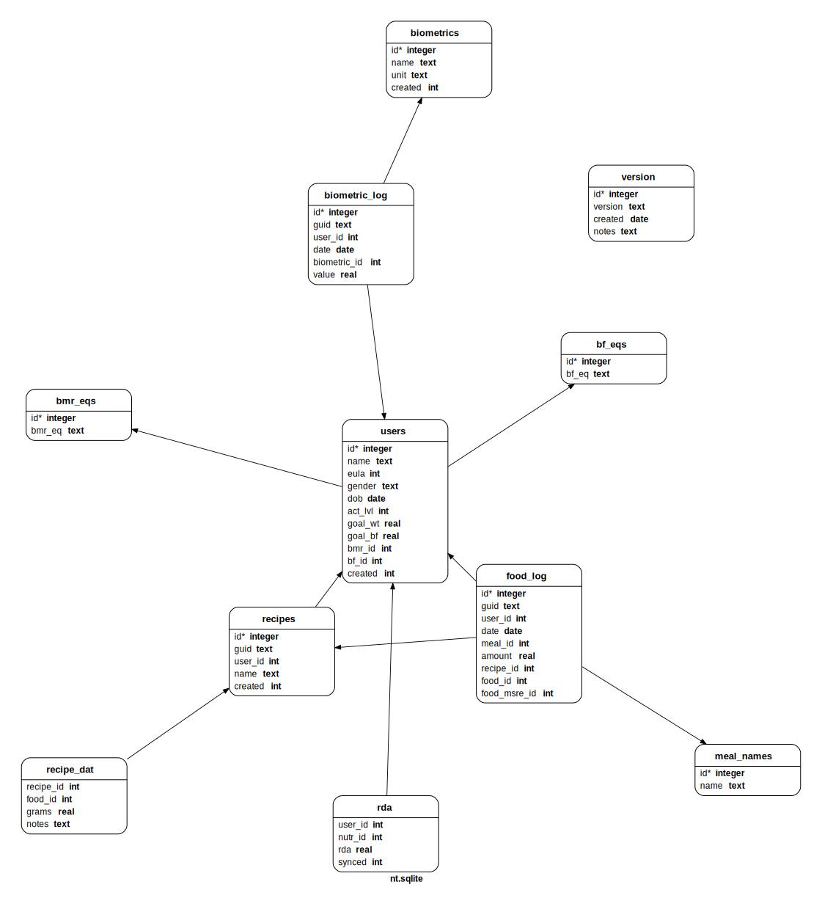

***********
 nt-sqlite
***********

SQL and CSV files for setting up nutra portable SQL database.

See CLI:    https://github.com/nutratech/cli

Pypi page:  https://pypi.org/project/nutra

Building the database
#########################

1. If you are committing schema design changes, bump the version for the corresponding tablename in ``tables.sql``.

2. Create the database with,

.. code-block:: bash

    cd sql
    bash build.sh

3. Verify the tables (again inside the SQL shell :code:`sqlite nutra.db`),

.. code-block:: sql

    .tables
    SELECT * FROM versions;
    .exit

4. If everything looks good, commit and copy any changes in SQL over to the ``cli`` (python) and ``nt-android`` (java) repos.

Tables (Relational Design)
##########################

See :code:`sql/tables.sql` for details.

This is frequently updated, see :code:`docs/` for more info.

